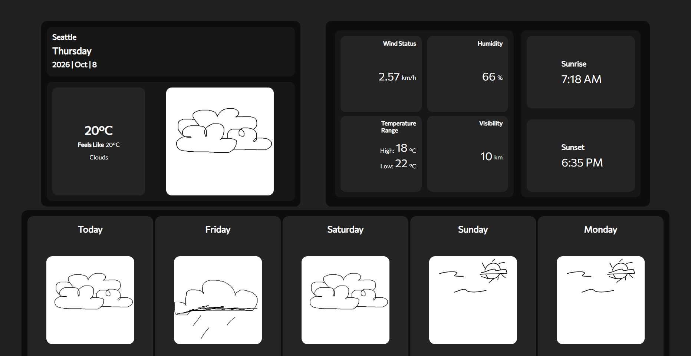

# 5-Day-Forecasting - Overview

<h1>Project Overview</h1>
This project is a 5-day forecasting website using OpenWeatherMap and Typescript. It is designed as a project for fun to test using api keys n stuff.

## Features

- **Feature 1**: Shows the date, city (Seattle), current weather, and temperature in celsius
- **Feature 2**: Shows wind speed in km/h, humidity %, visibility in km, temperature highs & lows, and sunset or sunrise time.
- **Feature 3**: Shows a 5-day prediction for the next few days

## Installation

### Windows Installation

1. Clone the repository while **inside an empty folder**
   ```bash
   git clone https://github.com/marcdatboi/5-Day-Forecast-Website.git .
   ```

2. Install dependencies:
   ```bash
   npm install
   ```

3. Run the application:
   ```bash
   npm run dev
   ```

### Mac Installation

1. Clone the repository while **inside an empty folder**
   ```bash
   git clone https://github.com/marcdatboi/5-Day-Forecast-Website.git .
   ```

2. Install dependencies:
   ```bash
   npm install
   ```

3. Run the application:
   ```bash
   npm run dev
   ```

## Screenshots



## Requirements

- **Node.js** >= 16.x i think
- **Dependencies**: vite, npm
